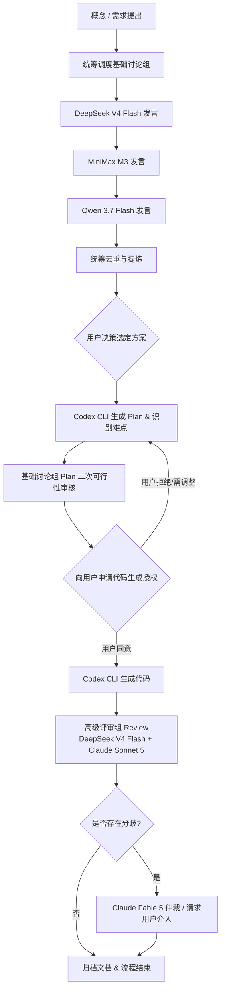

# 金铲铲之战 AI 屏幕监控与辅助决策系统 (JianChanChan-AI)

## 1. 系统愿景与核心架构
本项目是一个基于计算机视觉与多大语言模型协同编排的金铲铲之战（TFT）屏幕实时识别与辅助决策系统。

### 核心功能矩阵
- **屏幕与窗口捕获**：支持各类主流模拟器及 PC 客户端的窗口自动查找、自适应缩放与高清帧捕获。
- **视觉感知与识别 (Vision Pipeline)**：
  - **棋盘弈子识别**：4x7 网格布局，识别弈子种类、星级、装备配置。
  - **备战席监控**：己方 9 格备战席与侦察时对手备战席的留牌分析。
  - **商店与牌库追踪**：当前 5 卡槽识别与全局抽牌/卡池剩余概率计算。
  - **局内状态感知**：回合阶段 (Stage)、金币数 (Gold)、等级 (Level)、血量 (HP)、羁绊激活层级。
  - **对手侦察追踪**：多对手阵容快照缓存与对局胜率/对位推演。

---

## 2. 团队多模型协同开发规范 (Multi-Model Orchestration)

### 2.1 权限控制与执行铁律
1. **非文档修改授权铁律**：在进行除文档之外的任何文件修改、重构或代码变更前，**必须先明确向用户申请并取得授权**。
2. **唯一代码生成执行端**：
   - **Codex CLI** 是本项目中**唯一**允许直接生成和修改源代码的工具。
   - 所有参与讨论、评审的模型（包括总体统筹、基础讨论组、高级评审组、仲裁模型）**仅拥有方案构思、文档修改和评审意见输出的权限**，严禁直接修改源码。
3. **工具调用安全规范 (Tool Invocation Governance)**：
   - 所有 OpenRouter 模型及 Codex CLI 的工具调用接口必须严格受限（详见 [docs/tool_governance_policy.md](docs/tool_governance_policy.md)）。
   - 非 Codex CLI 模型发起的文件写入工具仅允许操作文档类路径 (`*.md`, `docs/`)，任何越界写操作都会被拦截。
   - Codex CLI 发起任何源码生成/修改操作前，必须具备用户授予的明确授权标志。

### 2.2 角色分工
| 角色名称 | 模型/工具 | 职责范围 | 权限边界 |
| :--- | :--- | :--- | :--- |
| **总体统筹** | GitHub Copilot (Gemini 3.7 Flash) | 流程调度、发言顺序控制、方案去重与提炼、向用户汇报与申请授权 | 文档修改、流程调度 |
| **基础讨论组** | DeepSeek V4 Flash<br>MiniMax M3<br>Qwen 3.7 Flash | 架构设计、算法方案分析、概念探讨、Plan 难点初审 | 仅限文档与讨论 |
| **执行端** | Codex CLI | 接收确定方案，生成 Plan，在用户授权后生成与修改代码 | 唯一代码修改权限 |
| **高级评审组** | DeepSeek V4 Flash (独立Session)<br>Claude Sonnet 5 | 对生成的代码进行边界条件、安全性、规范性及一致性 Review | 仅限文档与审查意见 |
| **仲裁与终审** | Claude Fable 5 / 用户 | 解决多模型评审分歧或复杂死锁 | 仲裁与裁决 |

---

## 3. 标准开发流转闭环



---

## 4. 目录结构规范

```
JianChanChan/
├── config/                  # 运行与模型配置文件
│   ├── settings.yaml        # 系统运行全局配置
│   ├── rois.yaml            # 1920x1080 屏幕区域 ROI 定义
│   └── orchestration.yaml   # OpenRouter 与模型协作映射
├── data/                    # 赛季静态数据与模型权重
│   ├── season_data/         # 英雄、羁绊、装备配置
│   └── weights/             # YOLO 等视觉模型权重
├── src/                     # 系统核心源码 (由 Codex CLI 维护)
│   ├── capture/             # 窗口与屏幕抓取
│   ├── vision/              # 视觉特征提取、OCR与目标检测
│   ├── engine/              # 游戏状态建模与推演
│   └── orchestrator/        # 模型调度与协作核心
├── docs/                    # 系统设计、讨论与评审文档
└── requirements.txt         # Python 依赖清单
```
