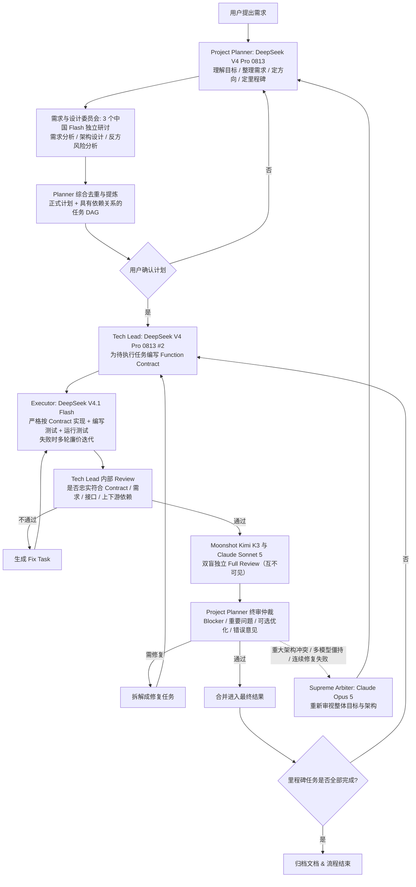

# 金铲铲之战 AI 屏幕监控与辅助决策系统 (JianChanChan-AI)

## 1. 系统愿景与核心架构
本项目是一个基于计算机视觉与多大语言模型协同编排的金铲铲之战（TFT）屏幕实时识别与辅助决策系统。

### 核心功能矩阵
- **屏幕与窗口捕获**：支持各类主流模拟器及 PC 客户端的窗口自动查找、自适应缩放与高清帧捕获。
- **视觉感知与识别 (Vision Pipeline)**：
  - **棋盘弈子识别**：4x7 网格布局，识别弈子种类、星级、装备配置。
  - **备战席监控**：己方 9 格备战席与侦察时对手备战席的留牌分析。
  - **商店与牌库追踪**：当前 5 卡槽识别与全局抽牌/卡池剩余概率计算。
  - **局内状态感知**：回合阶段 (Stage)、金币数 (Gold)、等级 (Level)、血量 (HP)、羁绊激活层级。
  - **对手侦察追踪**：多对手阵容快照缓存与对局胜率/对位推演。

---

## 2. 团队多模型协同开发规范 (Multi-Model Orchestration)

### 2.1 权限控制与执行铁律
1. **非文档修改授权铁律**：在进行除文档之外的任何文件修改、重构或代码变更前，**必须先向用户申请授权**；用户 5 分钟未响应时，非安全、非成本相关事项由 Supreme Arbiter（Claude Opus 5）代为判定（详见 [docs/team_roles_and_workflow.md](docs/team_roles_and_workflow.md) §2.8），安全与成本相关事项必须等用户本人回复。
2. **唯一代码生成执行端**：
   - **Executor（DeepSeek V4.1 Flash）** 是本项目中**唯一**允许直接生成和修改源代码的角色（运行于具备代码读写与测试执行能力的编码会话中）。
   - 其余所有角色（Project Planner、需求与设计委员会、Tech Lead、独立评审组、Supreme Arbiter）**仅拥有方案构思、文档撰写与评审意见输出的权限**，严禁直接修改源码。
3. **工具调用安全规范 (Tool Invocation Governance)**：
   - 所有模型角色发起的工具调用必须严格受限（详见 [docs/tool_governance_policy.md](docs/tool_governance_policy.md)）。
   - 非 Executor 角色发起的文件写入仅允许操作文档类路径 (`docs/**`, 根目录 `*.md`)，任何越界写操作都会被拦截。
   - Executor 发起任何源码生成/修改操作前，必须具备用户授予的明确授权标志。

### 2.2 分层角色分工

整体采用 **分层规划 + 廉价执行 + 多模型独立审查 + 高级仲裁**：Pro（DeepSeek V4 Pro 0813）负责"想清楚、管清楚"，Flash 负责"便宜地做出来"，Kimi 与 Sonnet 负责"独立地挑错"，三个中国 Flash 模型负责"低成本扩大前期思考面"，Opus 只处理极端复杂或无法解决的争议 —— 把昂贵模型的 token 尽可能集中在高价值决策上。

| 层级 | 角色 | 模型/实例 | 职责范围 | 权限边界 |
| :--- | :--- | :--- | :--- | :--- |
| 规划层 | **Project Planner**（项目总规划 / 全局统筹） | DeepSeek V4 Pro 0813 | 理解最终目标、整理需求、确定技术方向、制定里程碑，把项目组织成具有依赖关系的任务 DAG；汇总委员会意见形成正式计划；对独立评审结果做最终仲裁 | 文档修改、流程调度 |
| 发散层 | **需求与设计委员会** | DeepSeek V4.1 Flash<br>MiniMax M3<br>Qwen 3.8 Flash（独立实例） | 分别从**需求分析、架构设计、反方/风险分析**角度研讨方案，发现歧义、遗漏与潜在问题 | 仅限讨论文档 |
| 执行管理 | **Tech Lead** | DeepSeek V4 Pro 0813（独立于 Planner 的第二实例） | 为每个待执行任务编写 Function Contract（上下文/输入/输出/依赖/约束/不变量/验收标准/测试要求），把复杂任务拆成 Flash 可独立完成的小功能；执行后内部 Review 并生成 Fix Task | 契约与内部评审文档 |
| 执行层 | **Executor / Coder** | DeepSeek V4.1 Flash | 严格按 Contract 修改代码、实现 Function、编写测试并运行测试；失败时多轮廉价迭代 | 唯一代码修改权限（须经用户授权） |
| 评审层 | **独立评审组** | Moonshot Kimi K3<br>Claude Sonnet 5（双盲隔离） | 对同一份需求、设计、代码 Diff、测试结果独立进行 Full Review，互不可见对方意见，以双模型判断互相抵消 Bias | 只读 + 各自评审档案 |
| 视觉核验 | **视觉核验员**（双层） | 全量: DeepSeek V4 Flash Vision Exp<br>抽校: Qwen3-VL-30B-A3B-Thinking | 文本类模型无图像能力时的专项"眼睛":Flash 对全部图片廉价粗筛(场景/坏帧/黑边),VL-Thinking 对关键帧与随机抽样精校,输出 Vision QA 报告 | 只读图像/文档 + QA 报告 |
| 终审层 | **Final Arbitration** | Project Planner（DeepSeek V4 Pro 0813） | 综合两份 Review 分级裁定：Blocker / 重要问题 / 可选优化 / 错误意见；需修复的再次拆任务下发重走审查循环 | 仲裁记录文档 |
| 兜底层 | **Supreme Arbiter** | Claude Opus 5 | 仅处理重大架构冲突、多模型无法达成一致、系统连续修复失败等极端情况；只重审整体目标与架构，不参与普通任务 | 只读 + 裁决文档 |
| — | **用户** | 人类 | 最终决策、计划批准、代码授权、验收 | 全部 |

> 同名模型角色均使用**独立会话/实例**，互不共享上下文（如两个 DeepSeek V4 Pro 0813 分别担任 Planner 与 Tech Lead），避免自我背书。

---

### 2.3 标准开发流转闭环



详细流程阶段门、工件模板（Function Contract / Fix Task / Review Report / Arbitration Record）与升级规则见 [docs/team_roles_and_workflow.md](docs/team_roles_and_workflow.md)。

---

## 4. Milestone 1 交付物：对局录制与采样工具快速上手 (Quick Start)

当前 **Milestone 1** 已构建完毕，您可以在本地直接运行 `ChanSight.Cli` 绑定金铲铲游戏窗口开始实机录制与数据集采集：

```powershell
# 1. 编译并运行 CLI 交互工具
dotnet run --project src/ChanSight.Cli
```

### 快捷键与操作说明
- **`F6`**：全局【开始 / 停止】录制对局视频（自动保存为 MP4 格式）；
- **`F7`**：手动抓取单帧高清快照（存入 `snapshots/` 目录）；
- **`Q` 或 `Ctrl+C`**：安全退出并完成视频和 `meta.json` 封包。

输出产物将自动规范归档于：
- `datasets/recordings/{session_id}/` 会话目录（PNG 帧序列 + `meta.json` + `dataset_index.json`）
- `datasets/recordings/{session_id}/frames/` 与 `snapshots/`

> 注：录制产物为 **PNG 帧序列**（非 MP4），`meta.json` 启动即写 provisional、停止时封包（B2 加固，异常退出不丢元数据）。

---

## 4.5 实机验证与视觉推理 (Receipt)

M3 视觉管线已实现并每任务通过双盲评审；实机验收状态见 `docs/receipt_checklist.md`。

```powershell
# 延迟基准 (go/no-go, 默认 30fps/33.3ms 口径, 附 CPU 对照)
dotnet run --project src/ChanSight.Cli -- --probe "assets/models/paddleocr.onnx"
# 可选: 指定输入尺寸(静态 640 模型会拒绝其它尺寸并提示动态导出)
dotnet run --project src/ChanSight.Cli -- --probe "assets/models/paddleocr.onnx" --probe-size 480
# 视觉链路干跑(不加载模型, Stub 引擎, 全管道连通性验证)
dotnet run --project src/ChanSight.Cli -- --vision-dry-run
```

- 模型权重置于 `assets/models/`（已 gitignore）；实机基准: DirectML mean≈27ms / CPU mean≈27ms；
- 真实识别链路默认**关闭**（委员会防腐坏约定），`--vision-dry-run` 为低风险入口；
- 几何基准: 2026-09-12 经社区模板 + 用户人工目检二次修正（右锚定跨度比 0.8757），棋盘 28 格/备战席 9 槽/商店 5 槽对齐实机。

---

## 5. 目录结构规范

```
JianChanChan/
├── config/                  # 运行与模型配置文件
│   ├── settings.yaml        # 系统运行全局配置
│   ├── rois.yaml            # 1920x1080 屏幕区域 ROI 定义
│   └── orchestration.yaml   # OpenRouter 与模型协作映射
├── data/                    # 赛季静态数据与模型权重
│   ├── season_data/         # 英雄、羁绊、装备配置
│   └── weights/             # 视觉模型权重
├── src/                     # 系统核心源码 (由 Codex CLI 维护)
│   ├── capture/             # 窗口与屏幕抓取
│   ├── vision/              # 视觉特征提取、OCR与目标检测
│   ├── engine/              # 游戏状态建模与推演
│   └── orchestrator/        # 模型调度与协作核心
├── docs/                    # 系统设计、讨论与评审文档
└── requirements.txt         # Python 依赖清单
```
