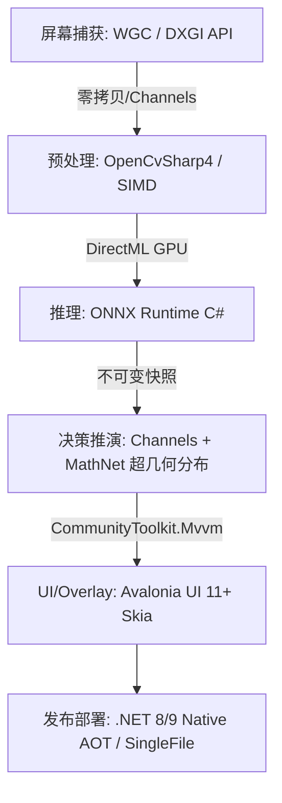

# 【铲瞳 (ChanSight)】C# 全栈架构、依赖库与替代方案详述

## 1. 架构设计原则
- **极低端到端延迟**：捕获 $\rightarrow$ 预处理 $\rightarrow$ 推理 $\rightarrow$ 决策 $\rightarrow$ 渲染控制在 $\le 30\text{ ms}$。
- **跨平台一致性**：核心逻辑与 UI 基于 .NET 8/9，未来可平滑迁移 macOS/Linux。
- **内存零分配与确定性**：采用对象池 (`ArrayPool`/`MatPool`) 与无锁并发管道 (`Channels`)，消除 GC 抖动。

---

## 2. 核心 6 大领域技术栈、NuGet 依赖与备选方案全景



### 领域 1：UI 与透明悬浮窗 (Overlay)
| 方案类别 | 选型方案 | 核心 NuGet 依赖 | 优劣势与适用场景 |
| :--- | :--- | :--- | :--- |
| **首选方案** ⭐ | **Avalonia UI 11+ (SkiaSharp 后端)** | `Avalonia`<br>`Avalonia.Desktop`<br>`Avalonia.Skia` | **优势**：跨平台 XAML、硬件加速、原生支持透明窗口 (`TransparencyLevelHint`) 与鼠标穿透，AOT 兼容好。<br>**劣势**：学习成本略高于标准 WPF。 |
| **备选方案 A** | **WPF (.NET 8/9)** | `Microsoft.Xaml.Behaviors.Wpf` | **优势**：Windows 最成熟，`AllowsTransparency=True` + `Topmost`。<br>**劣势**：**仅限 Windows**，DPI 缩放较复杂。 |
| **备选方案 B** | **WinUI 3 (Windows App SDK)** | `Microsoft.WindowsAppSDK` | **优势**：微软最新 Fluent UI。<br>**劣势**：仅 Windows 10+，打包与环境依赖重。 |
| **备选方案 C** | **Dear ImGui (ImGui.NET)** | `ImGui.NET` | **优势**：极轻量，调试极快。<br>**劣势**：UI 偏向极客调试工具，缺乏现代桌面应用交互组件。 |

---

### 领域 2：屏幕/窗口高速帧捕获 (Screen Capture)
| 方案类别 | 选型方案 | 核心依赖 / API | 优劣势与适用场景 |
| :--- | :--- | :--- | :--- |
| **首选方案** ⭐ | **Windows.Graphics.Capture (WGC)** | `CsWin32` / WinRT API | **优势**：Windows 10/11 官方推荐，GPU 直采，支持窗口级遮挡捕获，延迟 **$< 3\text{ ms}$**。<br>**劣势**：需 Win10 1903+。 |
| **备选方案 A** | **DXGI Desktop Duplication** | `Vortice.Windows`<br>`Vortice.Direct3D11` | **优势**：延迟极低（$< 2\text{ ms}$），全屏捕获性能最优。<br>**劣势**：对窗口化/多显示器处理相对繁琐。 |
| **备选方案 B** | **macOS ScreenCaptureKit** | macOS 12.3+ 原生 API | **优势**：macOS 平台硬件级捕获。<br>**劣势**：仅限 macOS。 |
| **淘汰方案** | **BitBlt / GDI / OpenCV VideoCapture** | `System.Drawing.Common` | **淘汰原因**：CPU 密集，延迟高（$> 30\text{ ms}$），不支持硬件加速。 |

---

### 领域 3：视觉模型推理引擎 (Vision Inference)
| 方案类别 | 选型方案 | 核心 NuGet 依赖 | 优劣势与适用场景 |
| :--- | :--- | :--- | :--- |
| **首选方案** ⭐ | **Microsoft.ML.OnnxRuntime + DirectML** | `Microsoft.ML.OnnxRuntime`<br>`Microsoft.ML.OnnxRuntime.DirectML` | **优势**：微软官方一等公民，跨 NVIDIA/AMD/Intel GPU 统一加速，无需安装庞大 CUDA SDK，延迟 **$< 5\text{ ms}$**。<br>**劣势**：极限峰值性能比 TensorRT 略低 10%。 |
| **备选方案 A** | **ONNX Runtime (CUDA / TensorRT)** | `Microsoft.ML.OnnxRuntime.Gpu` | **优势**：NVIDIA 显卡上的极致性能。<br>**劣势**：强依赖 CUDA/cuDNN 环境，分发体积大。 |
| **备选方案 B** | **TorchSharp (LibTorch C#)** | `TorchSharp` | **优势**：PyTorch 原生体验。<br>**劣势**：运行库体积偏大（几百 MB），模型热切换不如 ONNX 灵活。 |
| **备选方案 C** | **ML.NET** | `Microsoft.ML` | **优势**：上层封装高。<br>**劣势**：增加抽象层开销，不适合高帧率推理。 |

---

### 领域 4：图像预处理与计算机视觉工具库
| 方案类别 | 选型方案 | 核心 NuGet 依赖 | 优劣势与适用场景 |
| :--- | :--- | :--- | :--- |
| **首选方案** ⭐ | **OpenCvSharp4 (带 MatPool 对象池)** | `OpenCvSharp4`<br>`OpenCvSharp4.Windows` | **优势**：算子最全，C++ 底层高性能，支持零拷贝直传 Tensor，模板匹配/色彩空间转换极快。<br>**劣势**：需带平台 Native DLL。 |
| **备选方案 A** | **SkiaSharp** | `SkiaSharp` | **优势**：纯 2D 高性能渲染与矢量绘制。<br>**定位**：适合在 Overlay 上自绘，但不擅长复杂的图像特征分析。 |
| **备选方案 B** | **SixLabors.ImageSharp** | `SixLabors.ImageSharp` | **优势**：100% 纯托管 C#，零平台依赖。<br>**劣势**：高频实时图像处理性能约为 OpenCV 的 1/3~1/5。 |

---

### 领域 5：状态管理、并发管道与概率推演
| 方案类别 | 选型方案 | 核心 NuGet 依赖 | 优劣势与适用场景 |
| :--- | :--- | :--- | :--- |
| **首选方案** ⭐ | **Channels + CommunityToolkit.Mvvm + MathNet** | `System.Threading.Channels`<br>`CommunityToolkit.Mvvm`<br>`MathNet.Numerics` | **优势**：`Channels` 提供高吞吐无锁生产者-消费者队列；源生成器消除反射开销；`MathNet` 提供超几何分布精确概率运算。 |
| **备选方案 A** | **ReactiveUI (Rx.NET)** | `ReactiveUI`<br>`System.Reactive` | **优势**：响应式流非常强大，与 Avalonia 契合度极高。<br>**劣势**：学习曲线较陡，高频流需注意避免过多闭包分配。 |
| **备选方案 B** | **LiteDB (离线对局持久化)** | `LiteDB` | **优势**：嵌入式 NoSQL，记录对局回放与复盘。<br>**定位**：非实时推理链路，仅作数据归档。 |

---

### 领域 6：打包发布与 Native AOT 部署
| 方案类别 | 选型方案 | 发布策略 | 优劣势与适用场景 |
| :--- | :--- | :--- | :--- |
| **首选方案** ⭐ | **.NET 8/9 Native AOT (单文件)** | `PublishAot=true`<br>`SelfContained=true` | **优势**：直接编译为原生机器码，启动 $< 50\text{ ms}$，体积小（约 30~50MB），无 GC 抖动，免安装运行时。<br>**注意事项**：禁止运行时动态反射，全部使用编译期代码生成。 |
| **备选方案 A** | **Self-Contained + ReadyToRun (R2R)** | `PublishReadyToRun=true` | **优势**：100% 兼容所有传统第三方库，无 AOT 修剪限制。<br>**劣势**：体积稍大（约 60~80MB）。 |
| **更新与分发** | **Velopack** | `Velopack` | **优势**：现代跨平台自动更新工具（替代 Squirrel）。 |

---

## 3. 推荐工程结构定义 (C# .NET 8/9)

```
ChanSight/
├── src/
│   ├── ChanSight.Core/           # 领域模型、牌库时序状态机、超几何概率算法
│   ├── ChanSight.Capture/        # WGC / DXGI 跨平台抽象与高速抓取管道
│   ├── ChanSight.Vision/         # ONNX Runtime (DirectML) + YOLOv11n + PaddleOCR
│   ├── ChanSight.Overlay/        # Avalonia UI 11 跨平台透明穿透悬浮窗
│   └── ChanSight.App/            # 主启动入口、依赖注入、AOT 配置
├── assets/
│   ├── models/                   # yolov11n.onnx, paddleocr.onnx
│   └── game_data/                # champions.json, traits.json
└── docs/                         # 设计与技术文档
```
