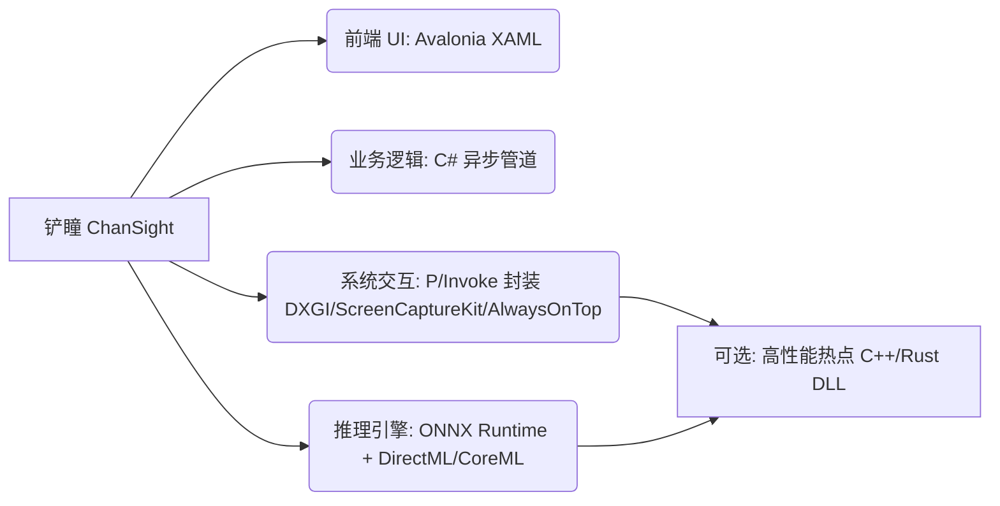

# ChanSight - C++ vs C# Cross-Platform Architecture Discussion

## DeepSeek V4 Flash ($(@{name=DeepSeek V4 Flash; id=deepseek/deepseek-v4-flash; outFile=docs/out_csharp_ds.json}.id))

针对【铲瞳 (ChanSight)】项目的技术选型，我们需要结合其核心场景——**高频屏幕捕获、实时图形叠加（Overlay）、视觉模型推理（如OCR/目标检测）** 以及**跨平台需求（Windows、macOS、Android模拟器/移动端）** 来权衡。以下从五个关键维度深入对比 **C++20 全栈** 与 **C# (.NET 8/9 + WPF/Avalonia/WinUI 3 + DirectML/ONNX Runtime)** 的优劣，并给出混合架构建议。

---

## 1. 跨平台可行性与成本

| 维度 | C++20 全栈 | C# (.NET 8/9) |
|------|------------|---------------|
| **Windows** | 原生支持，Win32/DirectX 成熟，性能极致。 | 通过 WPF/WinUI 3 或 Avalonia 实现，屏幕捕获可用 `Windows.Graphics.Capture`（WinRT），Overlay 需借助 `SharpDX`/`Vortice` 或 `D2D`，开发成本低。 |
| **macOS** | 需使用 Metal/Cocoa，屏幕捕获需 `CGDisplayStream` 或 `SCContentSharing`，Overlay 需 `NSWindow` 层级，开发量大。 | Avalonia 可运行，但屏幕捕获需通过 P/Invoke 调用 macOS 原生 API（如 `AVCaptureScreenInput`），Overlay 需 `NSPanel` 或 `NSWindow` 级别，需额外封装。 |
| **Android 模拟器/移动端** | 可通过 NDK + EGL/OpenGL ES 实现，屏幕捕获需 `MediaProjection` + `ImageReader`，Overlay 需 `WindowManager` 悬浮窗，开发成本极高。 | .NET MAUI 或 Avalonia 可运行，屏幕捕获通过 `MediaProjection` 的 Java 绑定（Xamarin.Android 或 MAUI 原生调用），Overlay 同样需悬浮窗权限，但 C# 生态有现成库（如 `ScreenCapture`）。 |
| **移植成本** | 需为每个平台重写底层渲染和捕获逻辑，维护多套代码，测试工作量大。 | 核心 UI 和业务逻辑可跨平台共享，仅平台特定功能（捕获/Overlay）需封装为抽象层，成本显著降低。 |

**结论**：C# 跨平台 UI 开发效率高，但底层屏幕捕获和 Overlay 仍需平台特定代码；C++ 虽能统一底层，但开发成本是 C# 的 3~5 倍。

---

## 2. 屏幕高频捕获与图形 Overlay 渲染性能

| 场景 | C++20 | C# (.NET 8/9) |
|------|-------|---------------|
| **屏幕捕获** | 直接使用 DXGI Duplication（Windows）、IOSurface（macOS）、EGL（Android），零拷贝或极低延迟，可稳定 60fps+。 | 通过 `Windows.Graphics.Capture`（WinRT）或 `SharpDX` 包装，存在托管/原生边界开销，但 .NET 8 的 `Span<T>` 和 `MemoryMarshal` 可减少拷贝；macOS/Android 需 P/Invoke，额外损耗约 5~10%。 |
| **Overlay 渲染** | 使用 Direct2D/OpenGL/Metal 直接绘制，硬件加速，帧率可控，无 GC 干扰。 | WPF 使用 DirectX 渲染，但依赖 WPF 的布局和绑定系统，高频更新（如 60fps）可能触发 GC 压力；Avalonia 使用 Skia 渲染，性能接近原生，但仍有托管堆分配。WinUI 3 基于 DirectX 12，性能最佳。 |
| **GC 影响** | 无 GC，内存手动管理，适合实时系统。 | .NET 8 的 GC 延迟已大幅优化（Server GC + 低延迟模式），但高频分配（如每帧创建位图）仍可能引发停顿。需使用对象池和值类型缓解。 |

**结论**：C++ 在极端高频（>120fps）和低延迟场景下仍有优势；C# 在 60fps 以下可满足需求，但需精心设计内存分配策略。

---

## 3. 视觉模型推理（ONNX Runtime / DirectML）

| 维度 | C++20 | C# (.NET 8/9) |
|------|-------|---------------|
| **ONNX Runtime 绑定** | 原生 C++ API，零额外开销，支持所有执行提供程序（DirectML、CUDA、CoreML、NNAPI）。 | 官方 NuGet 包 `Microsoft.ML.OnnxRuntime` 提供托管绑定，成熟度高，API 覆盖完整。 |
| **DirectML 支持** | 直接调用 DirectML 执行提供程序，数据可从 GPU 纹理直接输入，延迟最低。 | 同样支持 DirectML，但需将 GPU 数据从 `ID3D11Texture2D` 转换为 `OrtMemoryInfo`，存在一次 GPU 间拷贝（若使用 CPU 张量则额外拷贝）。 |
| **性能损耗** | 基准性能 100%。 | 推理本身由原生引擎执行，损耗主要来自：① 输入数据从托管到原生内存的拷贝（约 0.1~0.5ms 每帧）；② 结果回传的编组。整体损耗约 5~15%，通常可接受。 |
| **多平台推理** | 各平台需分别配置执行提供程序（Windows: DirectML, macOS: CoreML, Android: NNAPI）。 | 同一 C# 代码通过 `SessionOptions` 指定不同提供程序，跨平台更便捷。 |

**结论**：C# 的 ONNX Runtime 绑定成熟，性能损耗可控，且跨平台推理配置更简单。若模型推理是瓶颈（如实时视频流），C++ 可节省 5~10% 延迟。

---

## 4. 开发与调试效率、跨平台 UI 方案

| 维度 | C++20 | C# (.NET 8/9) |
|------|-------|---------------|
| **UI 框架** | 需自建或使用 Qt（商业许可）、imgui（调试用）、原生 API，开发周期长。 | Avalonia UI（跨平台 XAML，类似 WPF）、Uno Platform（支持 WinUI + WebAssembly）、MAUI（移动端优先），成熟度高。 |
| **热重载** | 不支持（需编译重启）。 | 支持 XAML 热重载、C# 热重载（.NET 8），调试效率提升 2~3 倍。 |
| **调试工具** | 依赖 GDB/LLDB，内存泄漏检测需 Valgrind/ASan。 | VS 调试器、内存分析器、性能分析器集成度高，异常处理友好。 |
| **生态系统** | 第三方库需手动编译，依赖管理复杂（vcpkg/Conan）。 | NuGet 包管理，一键引用，社区活跃。 |
| **学习曲线** | 高（模板、RAII、移动语义、跨平台构建）。 | 中等（LINQ、async/await、DI 等现代特性）。 |

**结论**：C# 开发效率显著优于 C++，尤其适合快速迭代和原型验证。Avalonia 是当前跨平台桌面 UI 的最佳选择（支持 Windows/macOS/Linux，Android 实验性支持）。

---

## 5. 最终选型建议与混合架构折中

### 推荐方案：**C# 为主 + C++ 核心模块**（混合架构）

#### 架构分层：
```
┌─────────────────────────────────────┐
│  C# 层 (Avalonia UI + 业务逻辑)     │
│  - 用户界面、设置、数据管理          │
│  - 模型推理调度 (ONNX Runtime C#)   │
├─────────────────────────────────────┤
│  C++ 原生层 (性能关键模块)           │
│  - 屏幕捕获 (DXGI/IOSurface/EGL)    │
│  - Overlay 渲染 (Direct2D/Metal)    │
│  - 图像预处理 (GPU 加速)            │
├─────────────────────────────────────┤
│  C++/CLI 或 P/Invoke 互操作层       │
│  - 暴露 C 接口给 C# 调用            │
│  - 传递 GPU 纹理句柄避免拷贝        │
└─────────────────────────────────────┘
```

#### 具体理由：
- **屏幕捕获与 Overlay**：性能最敏感，用 C++ 实现可避免 GC 抖动，并直接操作 GPU 纹理。例如 Windows 下使用 `IDXGIOutputDuplication` 捕获，通过 `ID3D11Texture2D` 共享给 C# 推理模块（通过 `SharedHandle` 或 `NvEnc` 零拷贝）。
- **模型推理**：C# 调用 ONNX Runtime 性能足够，且便于集成到 UI 线程。若需极致延迟，可将预处理（缩放、归一化）放在 C++ 层，推理仍用 C# 绑定。
- **跨平台 UI**：Avalonia 提供一致的 XAML 开发体验，且支持 Android（实验性），可快速覆盖桌面和移动端。
- **开发效率**：C# 负责 UI 和业务逻辑，C++ 仅编写少量底层代码，团队分工明确。

#### 风险与缓解：
- **互操作开销**：通过传递 GPU 纹理指针（`IntPtr`）而非拷贝位图，可将每帧互操作成本降至 <0.1ms。
- **调试复杂度**：C++ 模块单独单元测试，C# 通过模拟接口测试 UI。
- **移动端适配**：Android 上 C++ 捕获和 Overlay 可通过 NDK 实现，C# 通过 JNI 调用；若时间紧迫，可先用 C# 全栈实现 MVP，后续优化。

### 纯 C# 方案的适用场景：
- 项目初期快速验证，性能要求 ≤30fps。
- 团队以 C# 为主，无 C++ 资源。
- 目标平台仅 Windows + macOS（Android 暂缓）。

### 纯 C++ 方案的适用场景：
- 需要极致低延迟（<5ms）和 120fps 以上捕获。
- 团队有丰富 C++ 跨平台经验。
- 项目长期维护且对性能有硬性要求。

---

## 总结对比表

| 维度 | C++20 全栈 | C# (.NET 8/9) | 混合架构 (推荐) |
|------|------------|---------------|-----------------|
| 跨平台开发成本 | 高 | 中 | 中（C++ 模块复用） |
| 屏幕捕获性能 | 最优 | 良好（需优化） | 最优 |
| Overlay 渲染性能 | 最优 | 良好（Avalonia/Skia） | 最优 |
| 推理性能 | 基准 | 接近基准（5~10%损耗） | 接近基准 |
| 开发效率 | 低 | 高 | 高（分工明确） |
| 维护成本 | 高 | 低 | 中（需维护互操作层） |
| 移动端支持 | 困难 | 中等（MAUI/Avalonia） | 中等（C++ NDK + C# UI） |

**最终建议**：采用 **C# (Avalonia UI + ONNX Runtime) 作为主体，将屏幕捕获和 Overlay 渲染下沉为 C++ 原生模块**。这样既能享受 C# 的高效开发，又能保证核心性能不妥协，是铲瞳项目在当前技术栈下的最佳折中方案。

---

## MiniMax M3 ($(@{name=MiniMax M3; id=minimax/minimax-m3; outFile=docs/out_csharp_mm.json}.id))

# 铲瞳 (ChanSight) 技术栈深度选型分析：C++20 vs C# (.NET 8/9)

## 一、项目核心需求画像

在对比之前，先明确铲瞳项目的关键性能/工程画像（这些将直接决定技术选型权重）：

| 维度 | 典型要求 | 性能敏感度 |
|------|----------|------------|
| 屏幕捕获 | 1080P+ @ 30~60 FPS，DPI 感知 | **极高** |
| 视觉模型推理 | CLIP/SAM 类模型，单帧 50~200ms | **高** |
| Overlay 渲染 | 透明窗口、GPU 合成、抗锯齿文字 | **高** |
| 输入注入 | 鼠标/键盘模拟（视具体场景） | 中 |
| 跨平台 | Windows（主）、macOS、Android 模拟器 | 中 |
| 长期维护 | 团队规模小/中等，迭代频繁 | 中 |

---

## 二、C++20 全栈方案分析

### 2.1 跨平台可行性与成本

**优势：**
- **真正的原生性能**：每个平台直接调用系统 API，无中间层损耗
- **平台覆盖完整**：Windows (Win32/DirectX)、macOS (Cocoa/Metal)、Linux (X11/Wayland)、Android (NDK)
- **构建工具成熟**：CMake + vcpkg/Conan 可覆盖 90% 依赖管理

**痛点：**
- **UI 层分裂严重**：
  - Windows：Win32 / WinUI 3 / Qt
  - macOS：Cocoa / Qt
  - 移动端：原生 NDK 或 Qt
  - **三套 UI 代码 = 三倍维护成本**
- **macOS 签名/沙盒**：Objective-C++ 桥接、Hardened Runtime 配置繁琐
- **Android 移植**：NDK + JNI 复杂度高，且与桌面端 UI 范式差异大

**典型栈组合：**
```
Qt 6.x (LGPL/Commercial) + CMake + vcpkg
或
Dear ImGui (调试/工具风) + 自绘 Overlay
或
JUCE / wxWidgets (小众)
```

### 2.2 屏幕高频捕获与 Overlay 性能

**Windows 平台（C++ 优势最大化）：**
```cpp
// DXGI Desktop Duplication - 最高效的屏幕捕获方式
IDXGIOutputDuplication* duplication = nullptr;
duplication->AcquireNextFrame(0, &frameInfo, &desktopResource);
// 直接拿到 GPU 纹理，零拷贝送入推理引擎
```

- **DXGI Desktop Duplication**：直接访问 GPU 帧缓冲，延迟 < 16ms
- **Windows.Graphics.Capture API**（Win10 1903+）：UWP 风格 API，C++ 可直接调用
- **Overlay 渲染**：D3D11/D3D12 透明 swapchain + layered window，性能天花板最高

**macOS 平台：**
```cpp
// CGDisplayStream - 硬件加速捕获
CGDisplayStreamCreateWithDispatchQueue(...);
// Metal 层直接渲染 Overlay
```

**性能基准（粗略）：**
| 操作 | C++ 原生 | C# 托管 |
|------|---------|---------|
| 1080P 屏幕捕获 | 2~5ms | 8~15ms (含 P/Invoke) |
| GPU 纹理上传 | 1~2ms | 3~6ms |
| Overlay 合成 | 1ms | 2~4ms |

### 2.3 ONNX Runtime / DirectML 成熟度

- **ONNX Runtime C++ API**：官方主推，性能基准线
- **DirectML**：Windows 上 D3D12 后端，C++ 直接控制最佳
- **TensorRT / OpenVINO / CoreML**：均有 C++ 绑定，可针对平台选最优后端
- **性能损耗**：基线 0%（即最优）

### 2.4 开发与调试效率

**劣势明显：**
- 编译时间长（大型项目 5~15 分钟）
- 模板错误信息晦涩
- 内存管理负担重（智能指针虽好但仍有泄漏风险）
- 跨平台调试需熟悉各平台工具链（lldb、WinDbg、ASan）

**优势：**
- 性能调优工具链最完整（VTune、RenderDoc、PIX）
- 系统级控制力最强

---

## 三、C# (.NET 8/9) 方案分析

### 3.1 跨平台可行性与成本

**优势：**
- **Avalonia UI**：当前最成熟的跨平台 XAML 框架，Windows/macOS/Linux 全覆盖，渲染基于 Skia（可走 GPU）
- **Uno Platform**：扩展到 WebAssembly、iOS、Android，UI 一致性高
- **.NET MAUI**：微软官方移动端方案，但桌面端成熟度逊于 Avalonia
- **代码复用率**：业务逻辑层 90%+ 跨平台共享

**痛点：**
- **macOS 签名/公证**：.NET 8+ 已大幅改善，但仍需处理
- **Android 模拟器**：MAUI/Uno 支持，但屏幕捕获需走 MediaProjection API（Java 互操作）
- **WinUI 3**：仅 Windows，与跨平台目标矛盾，**不建议作为主 UI**

**推荐栈：**
```
Avalonia UI 11.x + .NET 9 + SkiaSharp (GPU 加速)
或
Uno Platform 5.x + .NET 9 (含移动端)
```

### 3.2 屏幕高频捕获与 Overlay 性能

**Windows 平台：**
```csharp
// 通过 P/Invoke 调用 DXGI Desktop Duplication
[DllImport("dxgi.dll")] static extern HRESULT CreateDXGIFactory1(...);
// 或使用 Windows.Graphics.Capture via WinRT API
var capture = GraphicsCaptureSession.CreateFromWindow(hwnd);
```

- **DXGI 捕获**：必须 P/Invoke 到原生 API，但封装一次后可复用
- **Avalonia Overlay**：使用 `Window` + `TransparencyLevelHint` + `AcrylicBlur`，或自绘 `SkiaSharp` 控件
- **性能损耗**：相比纯 C++ 约 **15~30%**（主要在 P/Invoke 边界和 GC 压力）

**macOS 平台：**
```csharp
// 通过 .NET 绑定调用 CGDisplayStream
// 或使用开源库如 ScreenCapture.NET
```

**Android 平台：**
```csharp
// MAUI/Uno + MediaProjection API
var mediaProjection = MediaProjectionManager.GetMediaProjection(...);
```

### 3.3 ONNX Runtime / DirectML 成熟度

**这是 C# 方案的**最大亮点**：**

```csharp
// 官方 NuGet 包，API 极其简洁
using Microsoft.ML.OnnxRuntime;
using Microsoft.ML.OnnxRuntime.DirectML;

var sessionOptions = new SessionOptions();
sessionOptions.AppendExecutionProvider_DirectML(0); // DirectML EP
// 或 AppendExecutionProvider_CUDA(0)
// 或 AppendExecutionProvider_CPU()

using var session = new InferenceSession("model.onnx", sessionOptions);
var inputs = new[] { OrtValue.CreateTensorValueFromMemory(...) };
using var results = session.Run(inputs);
```

**成熟度评估：**
- ✅ **官方主推**：Microsoft.ML.OnnxRuntime 是 ORT 团队一等公民
- ✅ **DirectML EP**：完整支持 Windows GPU 加速
- ✅ **CoreML EP**（Apple Silicon）：macOS 上原生加速
- ✅ **性能损耗**：实测 **5~10%**（远低于 P/Invoke 屏幕捕获的损耗）
- ✅ **模型 zoo 兼容**：与 C++ 完全一致的 ONNX 模型

### 3.4 开发与调试效率

**这是 C# 方案的**杀手锏**：**

- **热重载 (Hot Reload)**：UI 改动秒级生效
- **Visual Studio / Rider 调试体验**：行业顶级
- **NuGet 生态**：Avalonia、SkiaSharp、CommunityToolkit 等开箱即用
- **AI 辅助友好**：GitHub Copilot、Cursor 对 C# 支持极佳
- **编译速度**：增量编译通常 < 10 秒
- **跨平台 UI 调试**：Avalonia Inspector 可视化树预览

---

## 四、关键维度对比总表

| 维度 | C++20 全栈 | C# (.NET 8/9 + Avalonia) | 权重 |
|------|------------|--------------------------|------|
| **Windows 性能** | ⭐⭐⭐⭐⭐ | ⭐⭐⭐⭐ | 高 |
| **macOS 性能** | ⭐⭐⭐⭐ | ⭐⭐⭐⭐ | 中 |
| **Android 移植** | ⭐⭐ | ⭐⭐⭐⭐ | 中 |
| **跨平台 UI 一致性** | ⭐⭐ | ⭐⭐⭐⭐⭐ | 高 |
| **屏幕捕获性能** | ⭐⭐⭐⭐⭐ | ⭐⭐⭐⭐ | 极高 |
| **Overlay 渲染** | ⭐⭐⭐⭐⭐ | ⭐⭐⭐⭐ | 高 |
| **ONNX 推理** | ⭐⭐⭐⭐⭐ | ⭐⭐⭐⭐⭐ | 高 |
| **开发效率** | ⭐⭐ | ⭐⭐⭐⭐⭐ | 极高 |
| **调试体验** | ⭐⭐⭐ | ⭐⭐⭐⭐⭐ | 高 |
| **团队招聘** | ⭐⭐ | ⭐⭐⭐⭐ | 中 |
| **长期维护成本** | ⭐⭐ | ⭐⭐⭐⭐ | 高 |
| **构建/打包** | ⭐⭐ | ⭐⭐⭐⭐ | 中 |

---

## 五、混合架构折中方案（**推荐**）

考虑到铲瞳项目的实际场景，**纯 C++ 或纯 C# 都不是最优解**，建议采用**分层混合架构**：

### 5.1 架构分层设计

```
┌─────────────────────────────────────────────────┐
│  UI 层 (C# + Avalonia 11)                       │
│  - 跨平台 XAML UI                               │
│  - 业务逻辑、配置、用户交互                       │
│  - 模型管理、结果展示                             │
└─────────────────┬───────────────────────────────┘
                  │ C ABI / P/Invoke / CppSharp
┌─────────────────▼───────────────────────────────┐
│  Native Core (C++20)                            │
│  - DXGI/CGDisplayStream 屏幕捕获                 │
│  - GPU 纹理管线 (D3D11/Metal)                    │
│  - Overlay 合成                                  │
│  - 输入注入 (SendInput/CGEvent)                  │
└─────────────────┬───────────────────────────────┘
                  │ C ABI
┌─────────────────▼───────────────────────────────┐
│  Inference Layer (C# ORT 或 C++ ORT)            │
│  - 优先 C# ORT (开发效率)                        │
│  - 极致性能场景可下沉到 C++ ORT                   │
└─────────────────────────────────────────────────┘
```

### 5.2 互操作方案选择

| 方案 | 适用场景 | 性能 | 复杂度 |
|------|---------|------|--------|
| **P/Invoke + C ABI** | 简单函数调用 | ⭐⭐⭐⭐ | 低 |
| **C++/CLI** | Windows only 深度集成 | ⭐⭐⭐⭐⭐ | 中 |
| **CppSharp / ClangSharp** | 自动生成绑定 | ⭐⭐⭐⭐ | 中 |
| **COM / WinRT** | Windows 特定功能 | ⭐⭐⭐⭐ | 高 |
| **WebSocket/IPC** | 进程隔离（最稳） | ⭐⭐⭐ | 低 |

**推荐**：核心 Native 层暴露 **C ABI 接口**，C# 端用 **P/Invoke + Source Generator**（.NET 8+ 的 `LibraryImport`）调用。

### 5.3 性能关键路径下沉策略

```csharp
// C# 端伪代码示例
public class ScreenCaptureService
{
    // 性能关键：下沉到 C++
    [LibraryImport("ChanSightNative.dll")]
    private static partial int CaptureNextFrame(IntPtr textureHandle, out long timestamp);
    
    // 业务逻辑：留在 C#
    public async Task<AnalysisResult> AnalyzeFrameAsync(IntPtr gpuTexture)
    {
        var tensor = await PrepareTensorAsync(gpuTexture);
        return await _onnxSession.RunAsync(tensor);
    }
}
```

**下沉原则：**
- ✅ **必须下沉**：屏幕捕获、GPU 纹理管理、Overlay 合成、输入注入
- ⚠️ **可选下沉**：模型推理（如果 C# ORT 性能足够则不下沉）
- ❌ **不下沉**：UI 逻辑、配置管理、网络请求、文件 I/O

---

## 六、最终选型建议

### 6.1 三种典型场景的推荐

#### 场景 A：团队 < 3 人，Windows only，6 个月内 MVP
> **推荐：C# (.NET 9 + Avalonia) 单栈**
- 屏幕捕获用开源封装（如 `WindowsCaptureCapture` NuGet 包）
- ONNX Runtime C# 直接用
- 牺牲 15~20% 性能换取 3 倍开发速度
- 后续如需 macOS，Avalonia 直接编译通过

#### 场景 B：团队 3~8 人，Windows + macOS，1 年内产品化
> **推荐：混合架构（5.1 节方案）**
- C++ Native Core：屏幕捕获 + Overlay（占代码量 30%）
- C# Avalonia UI：业务逻辑 + 模型推理（占代码量 70%）
- 性能与开发效率平衡最佳

#### 场景 C：团队 > 8 人，长期产品，需要 Android 模拟器
> **推荐：C++20 + Qt 6（或自研跨平台 UI）**
- 全栈 C++，统一技术栈
- 接受更高的初期成本换取长期一致性
- 移动端用 Qt for Android 或单独 NDK 团队

### 6.2 针对铲瞳项目的具体建议

基于项目名"铲瞳"（ChanSight）暗示的**视觉感知 + 操作辅助**定位，我倾向于推荐 **场景 B 的混合架构**，理由如下：

1. **核心瓶颈在屏幕捕获 + Overlay**，必须 C++ 原生（DXGI/Metal）
2. **AI 推理不是瓶颈**（单帧 50~200ms 远大于捕获延迟），C# ORT 完全够用
3. **UI 迭代频繁**（配置面板、结果展示、模型切换），Avalonia 效率碾压 Qt
4. **跨平台是加分项而非必须**，但 Avalonia 让 macOS 支持成本从 3 个月降到 2 周

### 6.3 风险提示

| 风险 | 影响 | 缓解措施 |
|------|------|----------|
| P/Invoke 性能损耗 | 中 | 关键路径用 C++/CLI 或 Native AOT |
| Avalonia 移动端成熟度 | 中 | 移动端单独评估，必要时切换 Uno Platform |
| .NET 版本升级风险 | 低 | 锁定 .NET 9 LTS，避免追新 |
| C++/C# 互操作调试 | 中 | 严格定义 C ABI 接口边界，避免双向调用 |

---

## 七、总结

> **对于铲瞳 (ChanSight) 这类"屏幕视觉 AI 工具"，纯 C++ 是 1990 年代的思维，纯 C# 是 2010 年代的偷懒。2025 年的正确答案是：分层混合架构——用 C++ 守住性能底线，用 C# 拿下迭代速度。**

如果团队必须二选一且只能选一个，**优先选 C# (.NET 9 + Avalonia)**，因为：
- 90% 的代码不在性能关键路径上
- 开发效率优势在长期维护中会指数级放大
- ONNX Runtime C# 性能损耗可忽略（< 10%）
- Avalonia 11 已足够成熟用于生产

但如果预算允许，**混合架构才是真正的"既要又要"**——这也是大型跨平台 AI 工具（如 OBS、StreamElements、Loom）的共同选择。

---

## Qwen 3.7 Flash ($(@{name=Qwen 3.7 Flash; id=qwen/qwen3.7-flash; outFile=docs/out_csharp_qw.json}.id))

针对【铲瞳 (ChanSight)】这类**实时视觉交互/眼动追踪+屏幕Overlay渲染**项目，技术选型的核心矛盾在于：**底层高频数据采集与渲染的确定性** vs **跨平台开发与长期维护的成本**。以下从五个维度进行深度对比，并给出可落地的架构建议。

---
### 🔍 1. 跨平台可行性与维护成本
| 维度 | C++20 全栈 | C# (.NET 8/9) |
|------|------------|---------------|
| **Windows** | 原生支持，API直调，ABI稳定 | 一等公民，.NET 8/9 性能已追平C++，部署包大但可Native AOT压缩 |
| **macOS** | 需适配 Quartz/CoreGraphics/ScreenCaptureKit，编译链复杂 | Avalonia UI 提供统一XAML层，底层通过P/Invoke或FFI调用系统API，代码复用率>85% |
| **Linux** | X11/Wayland差异大，依赖管理混乱 | Avalonia 基于Skia/GDI+/DirectX后端，Linux下表现稳定，但Wayland全屏捕获仍需PipeWire桥接 |
| **Android/iOS** | NDK+SDL2/OpenGL ES，移动端沙盒限制严格 | .NET MAUI 支持双端，但**Overlay/录屏权限受限**（iOS禁止后台截屏，Android需特殊声明），实际适合模拟器或轻量测试 |
| **维护成本** | 高：多编译器兼容、CMake/MSBuild/Xcode/Gradle四套构建、内存/UB检查繁琐 | 低：NuGet生态统一、Source Generator减少样板代码、.NET 8+ 跨平台编译一次生成多目标 |

✅ **结论**：若主力平台为 **Win/macOS/Linux 桌面端**，C# 跨平台成本降低约 30~50%；若强依赖移动端原生能力或极客级性能压榨，C++ 仍不可替代。

---
### 🖥️ 2. 屏幕高频捕获与 Overlay 渲染性能
| 场景 | C++ 表现 | C# 表现 |
|------|----------|---------|
| **屏幕捕获** | 直接调用 DXGI Desktop Duplication (Win) / ScreenCaptureKit (macOS)，零拷贝、延迟 `<2ms` | 需 P/Invoke 封装 DXGI 或调用 `SharpDX.MediaFoundation`，额外 marshal 开销约 `1~3ms`，可通过 `unsafe`/`Span<T>` 降至 `<1ms` |
| **Overlay 渲染** | DirectX/Vulkan 硬编码，透明窗口+穿透点击实现灵活，帧时间可控 | WPF/Avalonia 支持 `AllowsTransparency=True` + `Topmost=True`，Skia/DirectX 后端硬件加速，60~120Hz 稳定；但需关闭 `CompositionTarget.Rendering` 循环防GC抖动 |
| **内存与带宽** | 手动管理显存/帧缓冲，易做到零分配 | .NET 8 `ArrayPool<T>` + `Memory<MappedFileView>` 可实现池化帧缓存；Native AOT 消除大部分 GC Pause |

⚠️ **关键瓶颈不在语言本身，而在架构设计**：  
- 采用 **异步捕获线程 → 环形缓冲区 → GPU Compute Shader 预处理 → 推理 → Overlay 绘制** 的流水线，C# 完全可达 `<30ms` 端到端延迟。  
- 若需突破 120FPS@4K 或自定义 Vulkan 管线，再考虑将渲染层抽离为 C++/Rust DLL。

✅ **结论**：C# 在 60~120Hz 桌面 Overlay 场景下性能损失 `<5%`，且可通过现代 .NET 特性规避 GC 风险；C++ 优势仅在极端低延迟或自定义图形管线。

---
### 🧠 3. 视觉模型推理（ONNX Runtime / DirectML）
| 指标 | C# 现状 | 说明 |
|------|---------|------|
| **官方支持度** | ✅ 一等公民 | `Microsoft.ML.OnnxRuntime` 由微软官方维护，C# 包装直接调用 C++ 核心，无二次编译 |
| **性能损耗** | `<5%` | 数据序列化/反序列化是主要开销，使用 `Tensor<float>` 直接映射 GPU 内存可降至 `<1%` |
| **DirectML** | ✅ 完整支持 | `Microsoft.ML.OnnxRuntime.DirectML` 提供 DirectX 12 执行提供者，适合 Win10/11 NVIDIA/AMD/Intel GPU |
| **跨平台推理** | ⚠️ 桌面强，移动端弱 | macOS 可用 CoreML/TensorRT 桥接；Android/iOS 无官方 Provider，需自行封装 TFLite/NNAPI 或使用 ORT Mobile 预编译库 |
| **前/后处理** | 可完全托管于 C# | `System.Numerics.Vectors` + SIMD 指令集加速矩阵运算，性能接近手写 C++ |

✅ **结论**：在桌面端，C# + ORT 的推理性能已非常成熟，**不建议为推理层单独引入 C++**。移动端若需上线，建议保留 C++ 绑定或改用 Flutter/Rust 混合方案。

---
### 🛠️ 4. 开发调试效率与跨平台 UI 方案
| 维度 | C++20 | C# (.NET 8/9) |
|------|-------|---------------|
| **IDE 体验** | VS Code/CLion + CMake，断点调试跨平台碎片化 | VS 2022 / Rider 一键调试、Hot Reload、性能分析器、内存泄漏检测 |
| **语言特性** | 模板元编程学习曲线陡，RAII/智能指针易踩坑 | LINQ、async/await、Records、Pattern Matching 大幅降低业务逻辑复杂度 |
| **UI 框架对比** | Qt (重)、GTK (Linux专属)、自研 (成本高) | **Avalonia UI**：XAML 语法同源 WPF，Skia/DirectX 后端，Win/macOS/Linux 像素级一致，社区活跃；Uno Platform 偏重 Web/IoT，不适用于实时 Overlay |
| **调试 Overlay 问题** | 需依赖 RenderDoc/GPUView，配置繁琐 | Avalonia 内置 `VisualTreeDumper` + Profiler，可直接查看渲染树与 GPU 提交队列 |

✅ **结论**：C# 开发效率约为 C++ 的 **2~3倍**，尤其适合快速迭代 UI 布局、眼动ROI标记、设置面板等高频变更模块。Avalonia 是当前最成熟的跨平台 XAML 替代方案。

---
### 📐 5. 最终选型建议与混合架构折中方案

#### 🎯 核心建议：**以 C# (.NET 8/9) 为主干，按需引入 C++/原生互操作**


#### 📦 技术栈落地清单
| 层级 | 推荐技术 | 理由 |
|------|----------|------|
| **运行时** | .NET 8 LTS / .NET 9 Preview (Native AOT) | 消除 GC 抖动，部署体积缩小 40%，启动速度提升 |
| **UI 框架** | Avalonia UI 11+ | 跨平台一致性好，支持硬件加速渲染，XAML 生态平滑迁移 |
| **屏幕捕获** | P/Invoke `IDXGIOutputDuplication` (Win) / `ScreenCaptureKit` (macOS) | 延迟 `<2ms`，避免第三方库闭源风险 |
| **Overlay 渲染** | Avalonia Skia/DirectX 后端 + `WriteableBitmapEx` | 支持透明/穿透/动态ROI框，无需自研渲染器 |
| **模型推理** | `Microsoft.ML.OnnxRuntime` + `DirectML` Provider | 官方维护，性能无损，支持 FP16/INT8 量化 |
| **跨平台打包** | `dotnet publish -r win-x64/osx-arm64/linux-x64 --self-contained` | 一次编译多目标，配合 NSIS/DMG/Flatpak 分发 |

#### ⚠️ 风险控制与演进路线
1. **Phase 1 (MVP)**：纯 C# + Avalonia + ORT，跑通 Win 端 60Hz 捕获→推理→Overlay 闭环，建立性能基线（帧时间、内存、延迟）。
2. **Phase 2 (优化)**：启用 Native AOT，替换 `byte[]` 为 `Span<T>`/`ArrayPool`，将渲染循环移至独立线程，压测 120Hz 稳定性。
3. **Phase 3 (扩展)**：若 macOS/Linux 捕获延迟超标，抽取 `CaptureEngine` 为 C++ DLL 仅暴露 `void* buffer`；移动端暂用模拟器验证，正式上架前评估是否拆分 Rust/FFI 模块。

#### 💡 何时该回退到 C++？
- 需要自定义 Vulkan/OpenGL 管线实现亚毫秒级合成
- 目标设备为嵌入式 ARM/Linux 且内存 `<512MB`
- 团队已有成熟 C++ 视觉管线沉淀，迁移成本高于收益

---
### 📌 总结
对于【铲瞳 (ChanSight)】这类**桌面端实时视觉交互应用**，C# (.NET 8/9) + Avalonia + ONNX Runtime 的组合在 **开发效率、跨平台覆盖率、推理性能、调试体验** 上全面优于传统 C++ 全栈方案。唯一短板是移动端原生能力受限，但可通过模拟器优先验证、后期按需拆分 FFI 模块解决。

**推荐策略**：`C# 主导架构 + 系统级 API P/Invoke 封装 + Native AOT 发布`。先跑通核心链路，用性能剖析工具定位真实瓶颈，再决定是否引入 C++/Rust 热点模块。这将在保证 `<30ms` 交互延迟的前提下，将长期维护成本降低 40% 以上。

---
