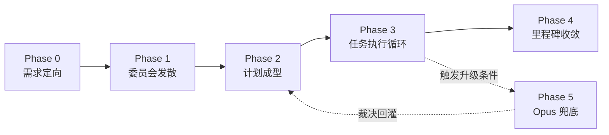

# 【铲瞳 (ChanSight)】开发团队角色与协同流程规范 v2

## 1. 流程总览与成本哲学

整个系统采用 **分层规划 + 廉价执行 + 多模型独立审查 + 高级仲裁** 的流程，核心原则是把昂贵模型的 token 尽可能集中在高价值决策上：

| 模型群体 | 定位 | 一句话职责 |
| :--- | :--- | :--- |
| **DeepSeek V4 Pro 0813** (Planner / Tech Lead) | 高价值决策 | "想清楚、管清楚" —— 规划、契约、仲裁 |
| **中国 Flash 模型群** (DeepSeek V4.1 Flash / MiniMax M3 / Qwen 3.8 Flash) | 廉价规模 | "便宜地做出来" + "低成本扩大前期思考面" |
| **Moonshot Kimi K3 / Claude Sonnet 5** 独立评审组 | 中立挑错 | "独立地挑错"，双盲检查互相抵消单模型 Bias |
| **Claude Opus 5** Supreme Arbiter | 极端兜底 | 只处理重大冲突、死锁与连续修复失败，不参与普通任务 |

---

## 2. 角色与职责

> 所有同名模型角色之间均为**独立会话/实例**，互不共享上下文（如两个 DeepSeek V4 Pro 0813 分别担任 Planner 与 Tech Lead），避免自我背书与思维同质化。

### 2.1 Project Planner（DeepSeek V4 Pro 0813 #1，项目总规划/全局统筹）

- 理解最终目标、整理需求，与用户反复澄清歧义；
- 确定整体技术方向、制定里程碑；
- 把项目组织成**具有依赖关系的任务 DAG**；
- 汇总需求与设计委员会的意见，去重与提炼，形成正式项目计划（须用户批准）；
- 对独立评审结果进行**最终仲裁**（分级裁定 + 修复任务下发）；
- 流程调度、向用户汇报与申请授权。

### 2.2 需求与设计委员会（3 个中国 Flash 模型，独立实例）

分别从三个视角对方案进行讨论，发现歧义、遗漏和潜在问题：

| 成员 | 视角 | 关注点 |
| :--- | :--- | :--- |
| DeepSeek V4.1 Flash | 需求分析 | 用户意图、验收口径、场景覆盖、需求缺失项 |
| MiniMax M3 | 架构设计 | 分层结构、接口边界、模块职责、可演化性 |
| Qwen 3.8 Flash | 反方/风险分析 | 边界条件、失败场景、性能/安全质疑、方案反例 |

- 输出：`docs/discussions/` 研讨记录；不写码、不裁决；
- 按主题轮换视角可进一步降低固化 Bias（需 Planner 在调度时注明）。

### 2.3 Tech Lead（DeepSeek V4 Pro 0813 #2，独立会话）

- 针对每一个待执行任务编写**Function Contract**（见 §4.2），把复杂任务拆成 Flash 可独立完成的小功能；
- 执行完成后进行**内部 Review**，重点检查实现是否忠实符合 Contract、需求、接口和上下游依赖；
- 不通过 → 出具 **Fix Task**（问题证据 + 期望行为 + 回归测试要求），交回 Executor 修复，直到达到内部通过标准；
- 通过 → 打包材料（需求、设计、Contract、Diff、测试结果、相关上下文）提交双盲评审。

### 2.4 Executor / Coder（DeepSeek V4.1 Flash）

- 严格按照 Contract 修改代码、实现 Function、编写测试并运行测试；
- 遇到失败可进行多轮廉价迭代（默认自助修复 ≤ 3 轮，超过即上报 Tech Lead，防止无限廉价循环烧 token）；
- 不修改 Contract、不擅自扩 scope、不动未授权文件；
- 一切源码操作须具备用户明确授权标志（见 §4.6）。

### 2.5 独立评审组（Moonshot Kimi K3 + Claude Sonnet 5，双盲隔离）

- 输入材料**完全一致**：同一份需求、设计、代码 Diff、测试结果和相关上下文；
- **互不可见**：双方各自独立完成 Full Review，不看到对方的意见（防串供、防从众）；
- 检查维度：需求符合度、架构合理性、代码正确性、边界条件、并发、安全、性能、错误处理、兼容性、可维护性、测试覆盖率；
- 输出：各自专属评审档案（如 `docs/reviews/kimi/`、`docs/reviews/sonnet/`），以两个不同模型的判断互相抵消 Bias。

### 2.6 终审仲裁（Project Planner / DeepSeek V4 Pro 0813 #1）

- 综合两份独立 Review 进行最终 Arbitration，对问题分级：
  - **Blocker**：真正阻塞点，必须修复；
  - **Important**：重要问题，应修复；
  - **Optional**：可选优化，记入技术债务或安排迭代；
  - **Rejected**：错误意见，驳回并说明理由（防止盲从任何单一模型）。
- 需修复的问题再次拆成任务交给 Executor，并重走 Tech Lead 内部 Review 与必要的 Kimi/Sonnet Review 循环；
- 只有当最终实现通过独立审查后才合并进入最终结果。

### 2.7 Supreme Arbiter（Claude Opus 5，兜底）

触发条件（任一）：

1. 出现重大架构冲突、多个模型无法达成一致；
2. 同一任务连续修复失败（如 Fix 循环 ≥ 3 轮仍未通过）；
3. 两份评审结论严重对立且 Planner 无法裁决；
4. 需要推翻既有里程碑/任务 DAG 的根本性争议；
5. **授权待决代理**：需要用户授权的事项在等待 5 分钟无回应时，由 Opus 代为判定（限非安全、非成本相关，见 §2.8）。

职责边界：只**重新审视整体目标和架构**、或在授权超时后代为决策，输出 `docs/decisions/` 裁决记录，结论回灌 Planner 重新规划；不直接修改代码、不参与普通任务。

### 2.8 用户（最终决策者）与授权超时代理

- 批准正式计划与任务 DAG；
- 授予代码写入授权（可按任务或按里程碑粒度）；
- 验收里程碑产物；在 Planner 无法裁决时介入。

**授权超时代理规则（5 分钟窗口）**：

1. Planner 向用户发起授权申请后，等待 **5 分钟**；
2. 超时未回应，且该授权事项**不涉及安全风险、不涉及新增/扩大成本**（如常规代码写入、常规文档变更、沿用既定预算的执行）→ 转交 **Supreme Arbiter（Claude Opus 5）代为判定**，判定结果即视为用户授权，并在授权日志中标注"Opus 代理"；
3. **涉及安全（隐私、权限、系统级变更、数据删除）或成本（引入付费依赖、扩大模型用量预算、大规模重新推理）的事项，绝不超时代判**，必须等待用户本人明确回复；
4. 用户在任意时刻回复，会覆盖 Opus 的代理判定。

### 2.9 视觉核验员（Vision QA，图像专项，双层结构）

- 定位：**只读辅助角色**，替人类与无视觉能力的文本模型完成图像内容判断；
- 权限：只读图像与文档；仅允许写入自身 QA 报告；**严禁修改源码与任何其他工件**；
- Session：无状态，按批次起新会话（符合 §8 Amnesia-Proof 原则），每批 ≤ 100 图；
- 双层分工：
  1. **全量核验层（Bulk QA）**：`deepseek/deepseek-v4-flash-vision-exp` —— 对**全部**图片做廉价粗筛：场景分类（大厅/加载/对战/结算）、全黑/模糊/花屏坏帧、黑边检测、重复候选标记（output 单价 $0.66/1M，批量成本极低）；
  2. **抽校核验层（Spot-Check QA）**：`qwen/qwen3-vl-30b-a3b-thinking` —— 对**关键帧**（Golden Set 候选、网格叠加对比图、标注样本）与**随机抽样帧**（按分层抽样取全量粗筛通过帧的 5~10%）做精细复核，thinking 推理输出逐项精度结论；
- 输出 **Vision QA 报告**：全量层 `docs/reviews/vision-qa/{batch_id}_bulk.md`，抽校层 `docs/reviews/vision-qa/{batch_id}_spot.md`（逐图结论 + 问题分级 + 证据引用）；
- 抽校分歧处理：抽校层推翻全量层结论时，扩大抽样到该场景即可，若与人工目检冲突则报 Project Planner 裁决；
- 升级路径：QA 结论影响任务验收时，由 Planner 决定是否纳入评审输入，不计入 Tech Lead/评审常规循环。

---

## 3. 流程阶段门 (Phase Gates)



| 阶段 | 负责人 | 动作 | 产物 |
| :--- | :--- | :--- | :--- |
| **Phase 0 需求定向** | Planner ↔ 用户 | 澄清目标与验收口径 | 需求摘要（用户确认） |
| **Phase 1 委员会发散** | 3 个 Flash | 三视角独立研讨 | 歧义/遗漏/风险清单 |
| **Phase 2 计划成型** | Planner | 综合去重 → 里程碑 + 任务 DAG | 正式计划（用户批准） |
| **Phase 3 任务执行循环** | Tech Lead / Executor / 评审组 | 见下方循环 | Contract / 代码 / Review / 仲裁记录 |
| **Phase 4 里程碑收敛** | Planner ↔ 用户 | 全部任务通过 → 验收 | 里程碑交付物 + 归档文档 |
| **Phase 5 升级路径** | Claude Opus 5 | 满足 §2.7 触发条件时兜底裁决 | 裁决记录，回灌 Phase 0/2 |

### Phase 3 任务执行循环（对 DAG 中每个任务，按拓扑序）

1. **Tech Lead** 生成 Function Contract（`docs/contracts/`）；
2. 用户授权 → **Executor** 按 Contract 实现 + 编写测试 + 运行测试，失败自助迭代；
3. **Tech Lead** 内部 Review → 不通过则出 Fix Task 交回 Executor；
4. 内部通过 → **Kimi 与 Sonnet** 双盲独立 Full Review；
5. **Planner** 终审仲裁（Blocker / Important / Optional / Rejected）；
   - 需修复 → 拆解成修复任务回到第 1 步；
   - 无争议通过 → 合并进入最终结果。
6. **阶段检查点（新增，2026-09-12 用户指令）**：每个阶段（Stage）结束、Sim 阶段切换、或实际下—阶段开工前，由**需求与设计委员会（3 个 Flash）确认进度**：分别从需求符合度、架构一致性、风险预判三个视角审阅该阶段产出与剩余任务，输出阶段确认意见；Planner 结合委员会意见决定：放行下一阶段 / 追加修正任务 / 提请用户裁决。
7. **可测与评审铁律（新增，2026-09-12 用户指令）**：每个任务的交付物必须具备可执行测试（单测/集成/探针至少其一，验收标准可量化），并经 **Tech Lead 内部 Review + 双盲独立 Review 两关**后方可标记完成；工具类/纯文档任务可降级为内部 Review 一次并注明理由。批量任务也可合并盲审，但合并批复必须逐任务列出。
8. **评审即提交铁律（新增，2026-09-12 用户指令）**：每个任务在评审通过、合并后，由 Planner 立即 `git commit`（提交消息遵循仓库惯例 `feat:/fix:/docs:` 并标注任务 ID 与评审结论）；共享文件跨任务时允许合并提交并在消息中列明全部涉及任务；禁止将多任务未评审改动长期留在工作区。
9. **提交即处理铁律（新增，2026-09-15 用户指令）**：后台代理任务**每产生一个提交,Planner 立即审查/验证/合并**,不等齐全部 worker;合并后即时全量回归。

---

## 4. 核心工件规范

### 4.1 任务 DAG

每个任务至少包含：

```
id | title | description | depends_on[] | milestone | acceptance | status
```

### 4.2 Function Contract 模板（Tech Lead → Executor 的唯一依据）

```markdown
# Contract {task_id}: {module}.{function}

## Context
# 背景、上游约定、为什么做

## Inputs
# 函数签名、参数类型、前置状态

## Outputs
# 返回值、副作用、落盘产物

## Context Pack
# Executor 的上下文清单（列文件路径而非转述内容，避免二次付费）
# - 必读文件:  需打开并理解的现有文件列表
# - 参照模式:  风格/写法上要模仿的现有代码
# - 待实现接口: 接口/基类路径
# - 需通过的测试: 新增与既有回归测试文件
 
## Dependencies
# 依赖的服务/接口/库/运行环境

## Constraints
# 语言/框架/现有代码风格/禁止事项

## Invariants
# 恒成立条件：线程安全、资源释放、边界兜底

## Acceptance Criteria
# 可验证的验收标准（量化、可测）

## Test Requirements
# 必写测试类型、关键用例、运行命令
```

### 4.3 Fix Task 模板（Tech Lead → Executor）

```markdown
# Fix Task {fix_id}（关联 Contract {task_id}）

## 问题描述
# 现象 + 证据（失败测试输出 / Review 引用）

## 期望行为
# 修复后应满足的行为

## 回归要求
# 必补/必跑的测试与命令
```

### 4.4 Review Report 维度（Kimi / Sonnet 通用）

结论（Pass / Pass-with-Notes / Fail）+ 问题清单（分级 + 证据）+ 11 个检查维度的覆盖说明与缺失项：需求符合度、架构合理性、代码正确性、边界条件、并发、安全、性能、错误处理、兼容性、可维护性、测试覆盖率。

### 4.5 Arbitration Record（Planner / Opus）

`Blocker / Important / Optional / Rejected` 分类、处置动作（Fix Task / 记入技术债务 / 驳回并说明）、责任人、流转去向。

### 4.6 授权日志

`docs/decisions/authorization_log.md`：记录每次代码写入授权的时间、范围、批准人，作为 Executor 授权钩子的依据。

---

## 5. 与 v1 流程的主要变更

| 维度 | v1 | v2 |
| :--- | :--- | :--- |
| 全局统筹 | GitHub Copilot (Gemini 3.7 Flash) | DeepSeek V4 Pro 0813 → Project Planner |
| 执行端 | Codex CLI | DeepSeek V4.1 Flash → Executor（专用编码会话，唯一写码角色） |
| 评审组 | DeepSeek V4.1 Flash + Claude Sonnet 5 | Moonshot Kimi K3 + Claude Sonnet 5（双盲隔离） |
| 仲裁 | Claude Fable 5 | Planner 终审仲裁 + Claude Opus 5 兜底 |
| 新增 | - | Tech Lead (Pro #2)、Function Contract / Fix Task 工件、任务 DAG、三视角委员会 |

---

## 6. 反模式（禁止事项）

- Pro 自己写码、自己评审自己的产出；
- 跳过委员会直接出计划、跳过 Contract 直接写码；
- Executor 擅自扩 scope 或修改 Contract；
- 无限廉价迭代而不升级；
- 把 Opus 拉进普通任务；
- 评审串供（同看对方结论、互相抄袭意见）。

---

## 7. 模型版本核定（以 OpenRouter 清单为准）

以下为各角色当前绑定的最新模型（核定日期 2026-09-12，出处 OpenRouter `/api/v1/models` 各家族创建日期最新者）：

| 角色 | 模型 | OpenRouter ID | 实例要求 |
| :--- | :--- | :--- | :--- |
| Project Planner | DeepSeek V4 Pro 0813 | `deepseek/deepseek-v4-pro-0813` | 独立会话 #1 |
| 委员会 · 需求分析 | DeepSeek V4.1 Flash | `deepseek/deepseek-v4.1-flash` | 独立会话 |
| 委员会 · 架构设计 | MiniMax M3 | `minimax/minimax-m3` | 独立会话 |
| 委员会 · 反方风险 | Qwen 3.8 Flash | `qwen/qwen3.8-flash` | 独立会话 |
| Tech Lead | DeepSeek V4 Pro 0813 | `deepseek/deepseek-v4-pro-0813` | 独立会话 #2（与 Planner 隔离） |
| Executor / Coder | DeepSeek V4.1 Flash | `deepseek/deepseek-v4.1-flash` | 专用编码会话（唯一写码角色，受授权钩子约束） |
| 独立评审 A | Moonshot Kimi K3 | `moonshotai/kimi-k3` | 盲审档案隔离 |
| 独立评审 B | Claude Sonnet 5 | `anthropic/claude-sonnet-5` | 盲审档案隔离 |
| 视觉核验员·全量 | DeepSeek V4 Flash Vision Exp | `deepseek/deepseek-v4-flash-vision-exp` | 无状态按批次（≤100 图/批），全量粗筛 |
| 视觉核验员·抽校 | Qwen3-VL-30B-A3B-Thinking | `qwen/qwen3-vl-30b-a3b-thinking` | 无状态按批次，关键帧 + 随机抽样精校 |
| Supreme Arbiter | Claude Opus 5 | `anthropic/claude-opus-5` | 仅升级流程激活 |

> 版本核定规则：模型发布新版本时，由 Project Planner 重新核对 OpenRouter 清单并更新本表与 `README.md`、`docs/tool_governance_policy.md` 中的模型名称，保持三处一致。

---

## 8. 记忆与上下文成本策略 (Memory & Context Cost Policy)

### 8.1 核心铁律：Amnesia-Proof 单体事实源原则

1. **长期记忆存在于工件（docs/ 文档 + git 代码），而非 conversation context**。任何角色必须能由"工件 + 空 session"完整重建其认知；持久 session 只是省钱优化，**不是正确性依赖**。
2. 单一事实源分层：`git 代码` → `docs 工件`（DAG / 计划 / Contract / 评审 / 决策）→ `各角色滚动 digest`。
3. **每轮收尾必须落盘最小工件**（见 §8.3），保证角色可被全新 session 无缝替换。

### 8.2 各角色 Session 类型 · 上下文播种 · 访问权限矩阵

| 角色 | Session 类型 | 会话种子（Context Seed） | 访问权限 | 前文讨论结论 |
| :--- | :--- | :--- | :--- | :--- |
| **Project Planner** | 持久单一 | 全量文档 + 任务 DAG + 决策日志 | 全部代码+文档（代码按需拉取，不预加载） | 全项目心智模型必须连续 |
| **需求与设计委员会** | 短命（按主题） | 相关文档子集 + 架构摘要 + 上轮讨论纪要 | 文档 | 工作在"代码之前"的方案空间 |
| **Tech Lead** | 按里程碑持久 + compact | 架构地图 + 相关模块历史 Contract + DAG 任务规格 | 全代码读取权（按需 pull） | 跨任务记忆外置为工件，不装全代码 |
| **Executor / Coder** | 短命（按任务） | **Context Pack**（Tech Lead 列的清单）+ 清单内文件 | 仅任务相关文件 | 每个字节只由真正写码的人读一次 |
| **独立评审组** | 无状态（每轮全新） | 标准评审包 + 项目 Context Brief | 评审包内材料 | 无记忆保证独立性，但不是零背景 |
| **视觉核验员** | 无状态（按批次） | 批次图像清单 + 核验要点 | 只读图像/文档 + 专属 QA 报告 | 双层：Flash 全量粗筛 + VL-Thinking 关键帧/随机抽校 |
| **Supreme Arbiter** | 无状态（仅升级/代判时） | 升级简报（争议全档案 + 架构地图 + DAG） | 只读 + 决策文档 | 只在极端争议或授权超时消费 token |

### 8.3 工件归属矩阵（每角色收尾时落盘什么）

| 角色 | 每轮收尾落盘的最小工件 | 位置 |
| :--- | :--- | :--- |
| Project Planner | 决策日志 / 仲裁记录 / DAG 状态更新 | `docs/decisions/`、`docs/plans/` |
| 委员会 | 研讨纪要（三视角意见 + 结论） | `docs/discussions/` |
| Tech Lead | Contract / Fix Task；**架构地图与接口索引更新** | `docs/contracts/`、`docs/plans/architecture_map.md` |
| Executor | Diff 说明（改了什么、为什么）+ 测试结果摘要 | 随 Fix Task / 合并 PR 归档 |
| 独立评审组 | 各自 Review Report | `docs/reviews/kimi/`、`docs/reviews/sonnet/` |
| 视觉核验员 | Vision QA 报告（逐图结论 + 问题分级） | `docs/reviews/vision-qa/` |
| Supreme Arbiter | 裁决记录 | `docs/decisions/` |

### 8.4 Tech Lead 上下文模型（澄清"是否需知全部代码"）

**不需要把全部代码装进 session。** 需要的是三件外置工件 + 按需读取权：

1. **架构地图**（`docs/plans/architecture_map.md`，Tech Lead 维护）：模块清单、接口清单、数据流、编码约定 —— 约百行文本替代"反复读全部代码"；
2. **Contract 档案**（`docs/contracts/`）：历史 Contract 即接口演化的权威记录，新 Contract 对照相关模块即可；
3. **每任务 Context**：任务规格 + 架构地图 + 相关模块历史 Contract + Executor 交回的 Diff —— 远小于全代码库。

### 8.5 Executor Context Pack 成本规则

- Tech Lead 在 Contract 的 `Context Pack` 章节**列文件清单**，而不是先读全部再转述（转述 = 二次付费：TL 读一遍 + 消息重传一遍，反而贵于 Executor 直接读取）；
- Executor 只读 Pack 清单内的文件 + Contract 本身；
- Executor 遇清单外疑问：查疑点优先自行定向读取（有授权时），或携带"缺失什么信息"回报 Tech Lead 补充清单 —— 严禁偷偷扩 scope。

### 8.6 评审包标准构成（Kimi K3 / Claude Sonnet 5 通用）

无状态评审不等于裸跑，评审包固定包含：

1. 需求描述与设计文档；
2. Function Contract（含 Context Pack）；
3. 代码 Diff；
4. 测试结果与运行日志；
5. **项目 Context Brief**（固定模板：架构地图摘要 + 编码规范 + 达标门禁）—— 保证评审在约定俗成之上挑错，而非质疑惯例。

无记忆指"每轮评审之间不保留、互不可见"，不指"不给背景"。

### 8.7 Compaction 与成本控制规则

1. **触发条件**：session 接近上下文上限（或里程碑切换）时执行 compaction；
2. **动作**：将本段会话摘要写回对应工件（§8.3），重置/续开 session 并以工件续命；
3. **禁止**：用"重读全代码/全文档"代替 compaction；禁止把评审、委员会的历史争论完整塞进 Planner/TL 的常驻上下文（只留结论与分歧点）；
4. **省钱次序**：同一理解需要持久化时，优先写工件（一次写、处处用），其次才靠持久 session 记忆。